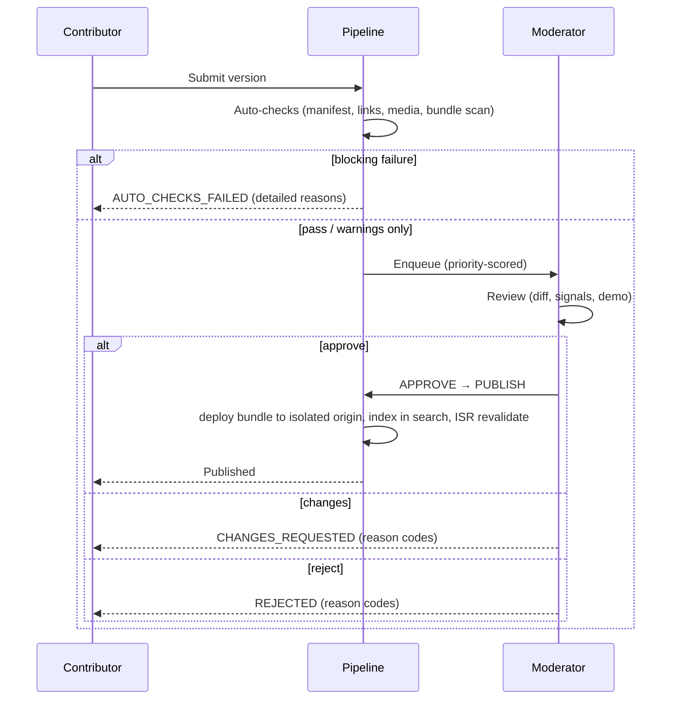
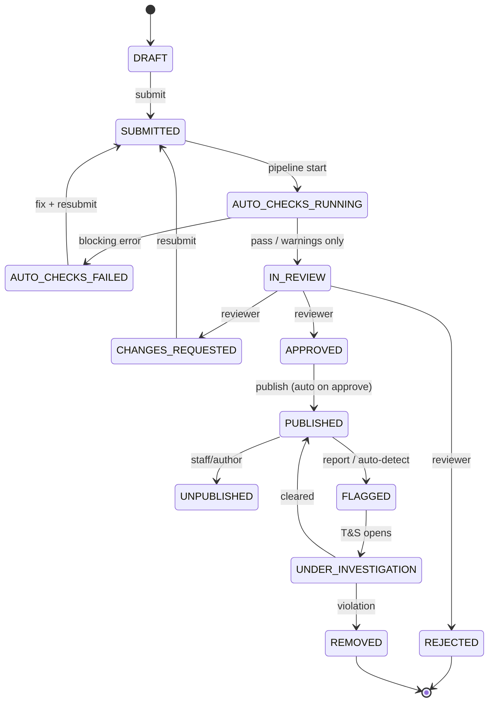
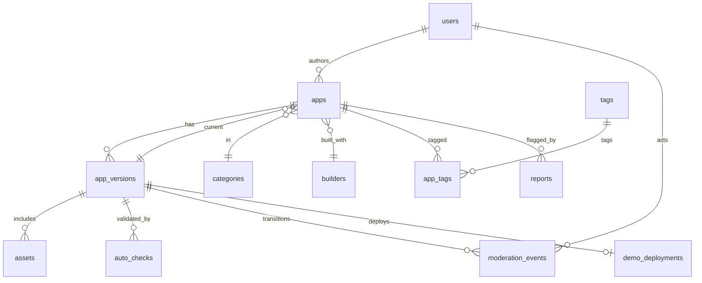

# 1PromptApps — Technical Design Document

| | |
|---|---|
| **Product** | 1PromptApps — a curated, proof-driven gallery of apps built from a single AI prompt |
| **Doc status** | Draft v1.0 — for review; **§0 adds a v0 (DB-less) ship plan** |
| **Author** | Software Architecture |
| **Last updated** | 2026-06-13 |
| **Audience** | Engineering, Design, Trust & Safety, Product |

> **Scope note.** This document is a standalone design for a *new* product. It is intentionally not coupled to the surrounding `synthropic-agent-ui` repository. Stack choices below are recommendations with rationale and explicit trade-offs; where a decision is genuinely the team's to make it is flagged as an **Open Question** in §20.

---

## Table of Contents

0. [v0 Implementation — Static, GitHub-backed MVP](#0-v0-implementation--static-github-backed-mvp)
1. [Overview & Product Thesis](#1-overview--product-thesis)
2. [Goals & Non-Goals](#2-goals--non-goals)
3. [Product Principles](#3-product-principles)
4. [Personas](#4-personas)
5. [Key User Flows](#5-key-user-flows)
6. [Information Architecture & Sitemap](#6-information-architecture--sitemap)
7. [Screens & Wireframes (plain text)](#7-screens--wireframes-plain-text)
8. [Visual / Design System](#8-visual--design-system)
9. [The Bundle Format & Manifest Spec](#9-the-bundle-format--manifest-spec)
10. [Submission & Moderation Workflow](#10-submission--moderation-workflow)
11. [System Architecture](#11-system-architecture)
12. [Tech Stack (with rationale)](#12-tech-stack-with-rationale)
13. [Data Model](#13-data-model)
14. [API Design](#14-api-design)
15. [Demo Hosting & Security Model](#15-demo-hosting--security-model)
16. [Search & Faceted Filtering](#16-search--faceted-filtering)
17. [SEO & Structured Data](#17-seo--structured-data)
18. [Trust, Licensing & Legal](#18-trust-licensing--legal)
19. [Non-Functional Requirements](#19-non-functional-requirements)
20. [Rollout Plan, Risks & Open Questions](#20-rollout-plan-risks--open-questions)
21. [Appendix: Best-Practice Sources](#21-appendix-best-practice-sources)

---

## 0. v0 Implementation — Static, GitHub-backed MVP

> **Read this first.** §§1–21 describe the full **v1+** product (Postgres, Inngest pipeline, signed uploads, dedicated search, admin console). **v0 deliberately builds none of that.** v0 proves the thesis — *credible, proof-driven case studies* — with the smallest possible surface: **no database, no backend, no queue.** GitHub is the editorial database, a manifest file is the record, the site is fully static, and it deploys to Vercel. Everything heavier is explicitly deferred (see §0.5).

### 0.1 Architecture (v0)

```
   Contributor                            Maintainer                Visitor / Crawler
       │ forks + opens PR to THIS repo        │ reviews + merges        │
       ▼                                      ▼                         ▼
 ┌──────────────────────────────────────────────────────────────────────────────┐
 │  ONE GitHub repo  1promptapps  (site code + submissions = editorial DB)         │
 │                                                                                 │
 │   app/ …  scripts/ …            ← the Next.js site (maintainers own this)       │
 │   apps/<username>/<slug>/        ← ONE app per folder (contributors add via PR)  │
 │     manifest.json (record) · prompt.md · index.html · assets/ · screenshots/    │
 │                                                                                 │
 │   GitHub Actions on PR: validate manifest + bundle + files (never execute them) │
 │   PR = submission · review · audit trail;  merge to main = "published"          │
 └───────────────────────────────────────┬─────────────────────────────────────┘
                          merge triggers  │  Vercel build
                                          ▼
              build scans apps/** → generated/apps.json → SSG renders every page
                                          │
                                          ▼  iframe (click-to-load, sandboxed §15)
                          ┌──────────────────────────────────────┐
                          │  Static app origin (separate)          │
                          │  apps.1promptapps.com serves the        │
                          │  committed bundle, OR contributor       │
                          │  liveUrl — never the gallery origin     │
                          └──────────────────────────────────────┘
```

**The whole loop is:** contributor opens a PR **to this repo** → CI validates the manifest **and the static bundle** → maintainer merges → Vercel rebuilds, regenerates `apps.json`, and statically renders every page → deploy. No request ever hits a database or a server function.

**One repo, not two.** v0 is a **monorepo**: the site code and the submitted apps live in the *same* repository — the one this doc is in. Submitting an app *is* opening a PR against this repo (the Obsidian/Raycast model — see §0.7). The `apps/` tree is the editorial database; a merge to `main` is a publish. This keeps the contributor's mental model trivial ("PR your app folder here") and means a single Vercel project rebuilds on every merge. (The repo-of-pointers split in §0.7 R1 stays available as a later scaling lever if the monorepo grows large.)

**Hosting the demo, the cheap way.** v0 self-hosts the submitted static app: the bundle (`index.html` + assets) is **committed to this repo** and served as static files from a **separate origin** (`apps.1promptapps.com`) — *not* from object storage, *not* through an AV-scan/deploy pipeline. CI validates the files (types, size, no secrets) in lieu of a malware scanner. This beats requiring a contributor `liveUrl`: demos never rot, and the platform controls availability. A `liveUrl` is still accepted as a fallback for apps that can't be bundled (e.g. ones needing a real backend a contributor hosts).

### 0.2 v0 decisions (locked)

| Concern | v1 design (§§) | **v0 choice** |
|---|---|---|
| **Repo topology** | App + infra repos | **Single monorepo (this repo).** Site code *and* submissions in one place; contributors PR their app folder here. |
| **Editorial database** | Postgres/Neon (§13) | **This GitHub repo's `apps/` tree.** A merged PR *is* a published record; Git history *is* the audit log. |
| **Record format** | `app_versions` rows + JSONB (§13) | **`manifest.json` per app** — the §9.2 schema, one file per `apps/<username>/<slug>/`. |
| **Site index / listing** | DB queries + facets (§14, §16) | **`apps.json` generated at build time** by scanning the repo; the site reads this single file. |
| **Hosting** | Next.js SSR/ISR on Vercel + R2 + CF (§11) | **Vercel, static/SSG only.** No Route Handlers, no Server Actions, no ISR webhooks. |
| **App pages** | RSC detail pages (§7.2) | **Static "friendly wrapper" pages** at `/{username}/{slug}` — pre-rendered case study (prompt, proof strip, outcome, screenshots) + a thin provenance banner wrapping the demo iframe. |
| **Demo hosting** | Isolated demo origin + bundle deploy (§15) | **Self-hosted static bundle on a separate origin** — `index.html` + assets committed to the repo, served from `apps.1promptapps.com`; `liveUrl` accepted as fallback. Same §15 sandbox + CSP. The gallery never hosts untrusted code on its own origin. |
| **Submission** | Web wizard + signed uploads (§7.3, §10.0 A) | **Git PR only** (§10.0 path B) — no upload UI. |
| **Moderation** | Admin queue + FSM + `moderation_events` (§10) | **The PR itself** — CI checks + human review + merge. PR template doubles as the contributor attestation checklist. |
| **Search/facets** | Typesense / Postgres FTS (§16) | **Client-side filter** over `apps.json` (category, builder, manual-edit level, source-available); URL query params for shareability. |

### 0.3 Repo layout (single monorepo — this repo)

Everything lives in one repository. **Contributors only ever touch `apps/<their-username>/<their-slug>/`**; maintainers own the rest.

```
1promptapps/                              # THIS repo (Vercel-connected) — site + submissions
│
├── apps/                                 # ← THE EDITORIAL DATABASE (contributors PR here)
│   └── <username>/
│       └── <slug>/                       #   ONE app = ONE folder = ONE PR
│           ├── manifest.json             #   REQUIRED — the §9.2 manifest = the record
│           ├── prompt.md                 #   REQUIRED — exact original prompt
│           ├── index.html                #   REQUIRED (bundle) — demo entry point
│           ├── assets/                   #   local JS/CSS/images via relative paths
│           └── screenshots/
│               ├── thumbnail.png         #   REQUIRED — 16:10, ≤ size cap
│               ├── desktop.png           #   REQUIRED ≥1
│               └── mobile.png            #   optional
│
├── app/                                  # the Next.js site (maintainers)
│   ├── page.tsx                          #   home / gallery
│   └── [username]/[slug]/page.tsx        #   static friendly wrapper page (SSG)
├── scripts/
│   ├── validate-all.ts                   #   `npm run validate` — the CI gate, runs locally too
│   └── build-registry.ts                 #   scans apps/** → generated/apps.json (+ facets)
├── generated/                            #   build output (gitignored or committed)
│   ├── apps.json                         #   the index the site reads
│   ├── categories.json · builders.json · sitemap.json
├── templates/static-app/                 # copy-me starter bundle for contributors
├── schemas/manifest.schema.json          # published JSON Schema (contributor CI + ours)
├── CONTRIBUTING.md                       # "fork → add apps/<you>/<slug>/ → open PR"
└── .github/
    ├── workflows/validate-pr.yml         # validate on PRs touching apps/**
    ├── workflows/link-rot.yml            # weekly lychee link check (§0.7 R2)
    ├── PULL_REQUEST_TEMPLATE.md           # = contributor attestation checklist
    └── CODEOWNERS                         # apps/** requires a maintainer approval
```

> **Why a monorepo (vs. a separate `gallery` repo):** for v0 the simplest possible contributor story wins — *"open a PR to this repo with your app folder."* One repo means one Vercel project, one CI config, one place to look. The cost is that submissions and site code share history; that's fine at v0 scale and is exactly how Raycast (`raycast/extensions`) operates. If/when the repo grows heavy, split the bundles out via the §0.7 R1 pointer model without changing the manifest.

> **Bundles in Git (the asset trade-off, resolved for v0):** v0 commits the **self-contained static bundle** plus **size-capped screenshots** straight into the repo (caps in §0.6). This is acceptable *only because* v0 forbids large/binary blobs and per-file size is capped by CI — so no Git LFS, no object storage, no signed uploads. It sidesteps the asset-in-Git problem (§10.0) and the bundle-deploy/AV-scan subsystem (§15.5) by serving committed files statically and validating them in CI instead. See §0.5–§0.6.

### 0.3a How a contributor submits (the v0 PR flow)

This is the **only** submission path in v0 — no web wizard, no upload form.

```
1. Fork  1promptapps  (or push a branch if you have write access)
2. Copy  templates/static-app/  →  apps/<your-username>/<your-app-slug>/
3. Drop in your static app:  index.html + assets/  (must run client-side only)
4. Fill  manifest.json  (name, tagline, category, builder, model, prompt info,
        manualEditLevel, externalApiDomains, license, permissionToFeature, …)
5. Paste your exact original prompt into  prompt.md
6. Add screenshots/  (thumbnail 16:10 + ≥1 desktop shot)
7. Run  `npm run validate`  locally — fix anything it flags
8. Open a PR.  Fill the PR template (the attestation checklist).
        → GitHub Actions validates and comments pass/fail per rule
        → Vercel posts a PREVIEW deploy: your case-study page, live, before merge
        → A maintainer reviews (safety + editorial), requests changes, or merges
9. Merge to main  →  Vercel rebuilds  →  your app is live at
        https://1promptapps.com/<your-username>/<your-app-slug>
```

The PR thread is the contributor's status surface and the permanent audit trail. There is no account to create beyond a GitHub login, and nothing to deploy yourself (unless you opt for a `liveUrl`).

### 0.4 v0 build & deploy checklist

**Repo & contract**
- [ ] In **this repo**, add the `apps/<username>/<slug>/` tree (the submissions root) alongside the site code — no separate gallery repo.
- [ ] Make the repo **public** so anyone can fork and open a PR; connect it to a single Vercel project.
- [ ] Publish `schemas/manifest.schema.json` derived from the §9.2 manifest (v0 fields — see §0.6).
- [ ] Add `templates/static-app/` (copy-me bundle), `CONTRIBUTING.md` (the §0.3a flow: fork → add `apps/<you>/<slug>/` → PR), `PULL_REQUEST_TEMPLATE.md`, and `CODEOWNERS` (require maintainer approval on `apps/**`).
- [ ] Turn on branch protection on `main`: PR + passing checks + ≥1 CODEOWNER approval before merge.

**CI (GitHub Actions = auto-checks) — `validate-pr.yml`, runs on PRs touching `apps/**`**
- [ ] **Never execute submitted code.** No `npm install`/build inside app folders; do **not** use `pull_request_target`; only parse, inspect, and validate files (least-privilege token, §18 of tech-design2).
- [ ] Validate each changed `manifest.json` against the JSON Schema (blocking).
- [ ] Structural: `manifest.json` + `prompt.md` + `index.html` (bundle) + required screenshots exist; `slug`/`username` match the folder path; `username` not reserved; `slug` unique within that username (blocking).
- [ ] File hygiene (blocking): allowed extensions only (§0.6); **no** `.env`/`.pem`/`.key`/`.p12`/credential-looking files; no hidden files; no symlinks; no executables/scripts; no `Dockerfile`.
- [ ] Size limits (blocking): per-file, per-screenshot, total-folder, file-count, path-depth caps (§0.6); screenshots are valid images of acceptable dimensions; thumbnail is 16:10.
- [ ] Enums valid (blocking): `category`, `builder` (or `other`), `manualEditLevel`; `permissionToFeature === true`; `license` present.
- [ ] `externalApiDomains` declared in the manifest for any external host the app calls (blocking — drives the demo-origin CSP, §0.6).
- [ ] Lint links — **only for the changed app**, fast/static where possible to avoid flaking on third-party outages (R3): `source.url` reachable; `license` is a valid SPDX id; if `demo.type=live`, `liveUrl` reachable. (Warning; hard fail on 4xx/5xx.)
- [ ] One app folder added/changed per PR (warning). CI posts the result as a PR comment — the contributor's status surface (Obsidian-style immediate feedback).
- [ ] `npm run validate` is the *same* command CI runs and contributors run locally; document it in `CONTRIBUTING.md` and ship `templates/static-app/` so they self-check before opening a PR (R5).

**Build registry (`generated/*.json`) — `build-registry.ts`**
- [ ] Walk `apps/**/manifest.json`, re-validate, normalize, derive `id = "<username>/<slug>"`, `path = /<username>/<slug>`, and the demo/thumbnail URLs.
- [ ] Emit `apps.json` (listing payload — only fields the gallery needs), plus `categories.json`, `builders.json`, `sitemap.json`.
- [ ] **Fail the build if any manifest is invalid** — the merged repo is the source of truth; a bad merge must not ship.

**Site (Vercel, static/SSG)**
- [ ] Next.js (App Router) **SSG** — no Server Actions, no Route Handlers, no DB client; reads `generated/*.json`.
- [ ] Gallery page: client-side faceted filter (category / builder / manual-edit level / source-available / search) over `apps.json`, with URL query params (§16 UX rules, §30 of tech-design2).
- [ ] **Static friendly wrapper page** at `/[username]/[slug]` via `generateStaticParams`: thin provenance **banner** (name · builder · model · duration · published · edit level · [Prompt][Source][Open full app][Report]) **outside** the iframe, then the demo iframe, prompt modal, outcome notes, screenshot lightbox.
- [ ] Demo embed: **click-to-load sandboxed iframe** pointing at the separate app origin (or `liveUrl`), with §15.2 `sandbox` tokens; banner lives on the gallery origin so provenance can't be spoofed.
- [ ] SEO: `generateMetadata` (title/description/canonical/OG/Twitter), JSON-LD (`SoftwareApplication` / `ItemList` / `BreadcrumbList`), `sitemap.xml` + `robots.txt`; demo origin `noindex` (§17).
- [ ] Gallery-origin CSP hardening per §15.4 / §33.1 of tech-design2 (`frame-src` allows only the app origin; no `unsafe-inline` scripts).

**Static app origin**
- [ ] Stand up the **separate origin** for demos: distinct registrable domain or `apps.1promptapps.com` (a subdomain is acceptable for v0 — it is still a different origin, so `allow-scripts allow-same-origin` is safe), CSP per §15.3 / §33.2, `noindex`, `nosniff`, no cookies.
- [ ] Generate the demo-origin `connect-src` from each app's `externalApiDomains` where feasible; broad `connect-src https:` is the MVP fallback (§15.3 trade-off).

**PR ops (no DB needed — see §0.7)**
- [ ] **Stale-bot**: mark PRs stale after ~14 days of inactivity, close after ~21 (Raycast pattern); FIFO review with a published **first-response SLA** (~1 week).
- [ ] Label-based triage (`needs-review` / `changes-requested` / `safety`) — the queue lives in GitHub labels + the PR list, not a database.
- [ ] **Scheduled link-rot Action (R2)**: weekly `lycheeverse/lychee-action` over all `source.url` / `liveUrl` / `externalApiDomains`; auto-open/update a tracking issue for dead links (broken-link monitoring without a service).

**Deploy**
- [ ] Connect repo to Vercel; production deploy on merge to `main`; **preview deploy per PR** renders the submitted app before merge — the reviewer's live preview (§7.6).
- [ ] Seed ~30 hand-curated apps (as PRs) before opening contributions (cold-start, §20.2).
- [ ] **Acceptance:** browse + filter + search; open `/{username}/{slug}`; banner shows provenance; app runs in the iframe; view prompt; open source/full app; submit via PR; CI validates; maintainer merges; app appears live — **with no database and no execution of submitted code** (§43 of tech-design2).

### 0.5 Explicitly deferred to v1+ (NOT in v0)

These are designed in §§1–21 and intentionally **not** built for v0:

- **Database** (Postgres/Neon, §13), **ORM/migrations**, denormalized facet tables.
- **Object storage / R2 + signed direct-to-storage uploads + AV/malware scan + image-processing pipeline** (§11, §15.5). *v0 serves committed, size-capped static files and validates them in CI instead — see §0.6.*
- **Web submission wizard** (§7.3) — v0 is Git-PR only.
- **Inngest** (durable workflows/queue) + ISR on-demand revalidation (§11, §10.4) — v0 rebuilds statically on merge.
- **Dedicated search engine** (Typesense/Meilisearch) — v0 is client-side filter over `apps.json`; graduate per §16.
- **Auth.js / OAuth, RBAC, admin console, FSM endpoints, `moderation_events`** — replaced in v0 by GitHub identity, PR review, and Git history (§10, §14.3).
- **Reports / appeals / reputation / auto-approve**, transparency metrics, dynamic OG images, email notifications, comments, view/click analytics, contributor dashboards (§10.5, §17, §40 of tech-design2).
- **API surface** (§14) — there is no runtime API in v0; the only "endpoint" is the static `generated/*.json`.

> **Add a DB when** any of these bite (tech-design2 §41): >200–500 apps, multiple submissions/day, non-technical users need a web upload form, private moderation notes, user accounts, analytics, instant publish without a Git merge.

> **Migration path.** Because the v0 record (`manifest.json`) is the §9.2 contract and CI uses the same published JSON Schema, v1 ingestion reads these same files into Postgres unchanged — additionally stamping each row's source commit SHA + PR number. v0 is a strict subset, not a throwaway.

### 0.6 v0 manifest & bundle contract (beyond §9)

These v0-specific rules tighten §9 for the Git-hosted, CI-validated model. They are enforced by `validate-pr.yml`.

**Identity rules.**
- `username`: lowercase, 3–32 chars, `[a-z0-9_-]`, must equal the folder; **reserved** (cannot be a handle): `apps app admin api submit about privacy terms categories builders static assets _app _next`.
- `slug`: lowercase, 3–80 chars, `[a-z0-9-]`, must equal the folder, unique **within the username** namespace.

**Honesty field — `manualEditLevel`** (v0 trust signal; complements §9's `reproducibility`, and is the gallery facet): one of `none-claimed | minor | moderate | significant | unknown`. The UI never claims an app was "verified 100% one prompt" — only that it was *submitted as* built from one prompt with edits disclosed (see §18).

**`externalApiDomains`** (string[]): every external host the demo calls from the browser. Declared in the manifest, surfaced to the reviewer, and used to derive the demo-origin `connect-src` (broad `https:` is the MVP fallback, §15.3).

**Allowed file extensions (bundle + media):** `.html .css .js .mjs .json .md .txt .png .jpg .jpeg .webp .gif .woff .woff2 .ico`. **Disallowed:** `.env .pem .key .p12 .pfx .sh .bat .exe .dll .so .dylib .py .rb .php .jar`, `Dockerfile`, `docker-compose.yml`, symlinks, hidden files. **SVG: disallow in v0** (XSS vector unless sanitized) — use PNG/WebP/JPEG.

**Size limits (v0):** folder ≤ **10 MB**; any file ≤ **2 MB**; screenshot ≤ **2 MB**; ≤ **100 files**; path depth ≤ **6**; path length ≤ **160 chars**. (Looser per-image caps than §9.1's 1 MB thumbnail since v0 has no image pipeline; revisit when one exists.)

**Screenshot specs (Raycast-grade):** **3–6** screenshots, PNG, thumbnail 1280×800 (16:10); **no sensitive data, no other apps visible, consistent backgrounds.** Enforced/eyeballed at review.

### 0.7 Operating model — lessons from comparable PR-based registries

v0 is a *curated, PR-driven registry that publishes a gallery* — the exact shape of **Obsidian community plugins** (`obsidianmd/obsidian-releases`), the **Raycast extension store** (`raycast/extensions`), and data-driven **awesome-\*** lists. Their proven operating practices, and what v0 adopts:

| Practice (who) | What they do | **v0 adopts** |
|---|---|---|
| **One linter command = the gate** (awesome-lint) | A single `npx awesome-lint` runs in CI; branch protection blocks merge unless it passes; runnable locally + as a pre-commit hook. | `npm run validate` is *the* gate — same code in CI and locally; documented in `CONTRIBUTING.md` so contributors self-check before opening a PR. |
| **Bot posts compliance feedback** (Obsidian) | An automated reviewer comments exactly what fails immediately on submission; humans then focus on *popular/high-risk* items. | CI comments pass/fail per rule on the PR; maintainers spend attention on safety + editorial judgment, not rote checks (mirrors §10.3 priority scoring). |
| **Registry-of-pointers, built code not committed** (Obsidian) | The central index holds only a pointer (`id`, `repo`, `author`); the manifest + built assets live in the *author's* repo, referenced by a **pinned release tag** (`1.0.0`, no built code in the index repo). | **See recommendation R1 below** — the strongest scaling lever for keeping our repo lean. |
| **PR lifecycle automation + review SLA** (Raycast) | FIFO review, first response ≈ within a week; a stale-bot marks PRs stale after ~14 days of inactivity and closes after ~21. | Add a **stale-bot** + a published **first-response SLA**; label-based triage (`needs-review`, `changes-requested`, `safety`). Keeps the queue honest without a DB (§0.4). |
| **Strict, specified assets** (Raycast) | Icon 512×512 PNG (light+dark); screenshots fixed dims/aspect, 3–6, no sensitive data, no other apps. | Adopted into §0.6 screenshot specs. |
| **Editorial naming** (Raycast) | App/command names follow a style guide — nouns over verbs, no hype, purpose clear. | Fold into `CONTRIBUTING.md` using the existing editorial-restraint tone (§3, §8): "Habit Heatmap", not "🚀 INSANE AI Todo". |
| **Identity/format guards** (Obsidian) | `id` must match across files, reserved substrings rejected, `owner/repo` format enforced. | Already covered by §0.6 identity rules (reserved usernames, slug == folder, uniqueness). |
| **Maintainers-only merge** (both) | Community can comment; only team members merge/publish. | `CODEOWNERS` + branch protection (§0.4). |

**Recommended better practices for v0 (beyond the locked decisions):**

- **R1 — Offer a "registry-of-pointers" path, not just commit-into-repo (Obsidian model).** Committing every bundle into `gallery/` is simplest but bloats the repo as it grows. Borrow Obsidian's split: a contributor keeps the manifest + bundle in *their own* repo and tags a release; our index references it by **`repo` + pinned tag/commit-SHA + content hash**, and the build fetches/snapshots it. Pros: our repo stays tiny, authors own updates, the SHA+hash pin defeats post-review tampering. Cons: a build-time fetch step and link-rot risk. **Recommendation: ship commit-into-repo as the v0 default (immutable, self-hosted, zero fetch), but design `manifest.json` to *also* carry an optional `repo`+`tag` pointer so the pointer path can switch on without a schema change.** Resolves §20 Q8.
- **R2 — Scheduled link-rot monitoring with `lychee` (no DB needed).** A cron GitHub Action (e.g. weekly) runs **`lycheeverse/lychee-action`** over every `source.url`, `liveUrl`, and declared `externalApiDomains`, and **opens/updates a tracking issue** (via *Create Issue From File*) listing dead links. This delivers the "broken-link monitoring" we deferred to v1 — as a stateless Action, not a service. Add to §0.4.
- **R3 — Pre-merge link checks stay fast and flake-free.** On PRs, only check the *changed* app's links (and prefer static inspection over live HTTP where possible, à la `hyperlink`) so CI doesn't flake on a third-party outage; push exhaustive crawling to the R2 cron.
- **R4 — Content-hash bundles even when committed.** Record a `contentHash` per bundle in `apps.json`; the wrapper page and any future migration can detect drift, and it's a free dedupe signal (§10.2 near-duplicate check, lite).
- **R5 — Make the validator a published package + template repo.** Like awesome-lint, publish the validator (`npx 1promptapps validate ./apps/<me>/<slug>`) and ship `templates/static-app/` so contributors scaffold and self-validate before the PR — fewer failed-CI round-trips.

---

## 1. Overview & Product Thesis

**1PromptApps** is a curated web platform that showcases real, working apps that were generated from a *single AI prompt*. Each submission is presented as a **compact case study**, not a banner ad: the original prompt, screenshots, a live demo (or a portable static bundle the platform hosts), a source link when available, the builder/tool used, the time-to-first-version, and **honest notes on what worked versus what required manual editing**.

The thesis is **proof over hype**. Most "AI app" directories are link farms optimized for novelty. 1PromptApps differentiates by being a *reproducibility-and-trust gallery*: every entry answers "could I do this too, and how far did the prompt actually get?" The visual language is deliberately editorial and product-like — calm typography, generous whitespace, monospace prompt blocks — and avoids flashy "AI" tropes (gradients, glow, sparkles, fake terminals).

The platform is **community-fed**: contributors submit through a standardized workflow and a portable **bundle format** (predictable folder structure + manifest), which the system validates, queues for moderation, ingests, and renders consistently.

---

## 2. Goals & Non-Goals

### Goals
- **G1 — Credible case studies.** Every app page presents prompt → outcome with consistent, structured fields that emphasize reproducibility and honesty.
- **G2 — Discoverability.** Fast faceted filtering by **category** and **builder/tool**, plus full-text search; SEO-friendly, server-rendered, crawlable pages.
- **G3 — Standardized contributions.** A documented bundle format + manifest schema; contributors submit either a **public live demo** or a **portable static bundle**.
- **G4 — Safe demos.** Host untrusted static bundles with strong origin isolation so a malicious demo cannot harm visitors or the platform.
- **G5 — Scalable moderation.** A reviewable submission pipeline with automated checks, a clear state machine, an immutable audit log, and an admin console.
- **G6 — Consistent presentation.** Manifest-driven rendering: thumbnails, screenshots, prompt blocks, and proof badges look identical across submissions.

### Non-Goals
- **N1 — Not an app builder.** We do not generate apps; we showcase them.
- **N2 — Not a general AI directory.** No tool listings, no affiliate spam, no "1000 AI tools" SEO pages.
- **N3 — Static client-side apps only.** v1 accepts only static web apps (HTML/CSS/JS that run entirely in the browser). They **may call external APIs directly from the client** — that's expected and allowed. They must not require server-side code that we host. This keeps our hosting to pure static files and removes all server-side execution risk, but **not** browser-side risk (see §15).
- **N4 — No social network (v1).** No following, DMs, or feeds. Comments are deferred (see §20).
- **N5 — No payments/monetization (v1).**

---

## 3. Product Principles

1. **Proof, not promises.** Show the prompt and the result side by side. If something needed manual edits, say so — that *increases* trust.
2. **Reproducibility is a first-class field.** `time-to-first-version`, `follow-up count`, `reproducibility: full | partial | none`, and `source available` are structured, filterable, and badged.
3. **Editorial restraint.** Neutral palette, strong type, no "AI" visual clichés. The work is the hero.
4. **Consistency by contract.** A manifest is the contract; the UI renders the manifest. Submitters cannot break layout.
5. **Safe by construction.** Untrusted code runs on a different origin, sandboxed, behind a strict CSP, with no access to platform cookies.
6. **Automate the rote, human-judge the rest.** Machines validate structure, links, and safety signals; humans make editorial and policy calls.

---

## 4. Personas

| Persona | Goal | Needs |
|---|---|---|
| **Visitor / Skeptic** | "Is prompt-to-app real? Show me proof." | Fast browsing, honest outcomes, working demos, the actual prompt |
| **Contributor / Builder** | "Show off what I built in one prompt." | Low-friction submission, clear status, predictable rendering, attribution |
| **Moderator** | "Keep quality high and the site safe." | Review queue, diffs, automated signals, decision shortcuts, audit trail |
| **Admin / Editor** | "Curate, feature, manage taxonomy." | Category/builder management, featuring, takedowns, transparency metrics |

---

## 5. Key User Flows

### 5.1 Browse → evaluate (Visitor)
```
Land on Home/Gallery
  → filter by Category and/or Builder (URL-encoded facets)
  → scan case-study cards (thumbnail + proof badges)
  → open App Detail
  → read prompt, view sandboxed live demo / screenshots
  → read "What worked / What needed edits"
  → click live demo or source link (opens isolated origin / external)
```

### 5.2 Submit an app (Contributor)
```
Sign in (GitHub/Google OAuth)
  → choose submission mode:
        (A) "I have a public live demo URL"
        (B) "Upload a static bundle (.zip)"
  → Option 1: paste manifest URL  → system fetches + prefills
    Option 2: fill the form        → system builds manifest
  → upload thumbnail + screenshots (direct-to-storage via signed URL)
  → preview the exact rendered case-study page
  → attest rights + permission to feature
  → Submit  → enters moderation pipeline
  → track status on "My Submissions" (auto-checks → in review → published)
```

### 5.3 Moderate (Moderator)


---

## 6. Information Architecture & Sitemap

```
/                         Home / Gallery (faceted grid, default sort = Featured/Recent)
/apps                     Full gallery (same component, explicit)
/[username]/[app-slug]    App page = case study + live demo viewer  ← CANONICAL, SSG+ISR
/apps/[slug]              301 → /[username]/[app-slug]  (legacy/global alias)
/embed/[username]/[app]   Minimal embeddable viewer (thin banner + iframe) for 3rd-party sites
/categories               Category index
/c/[category-slug]        Category-filtered gallery
/builders                 Builder/tool index
/b/[builder-slug]         Builder-filtered gallery
/search?q=&category=&builder=&repro=&sort=   Search results (SSR)
/submit                   Submission wizard (auth required)
/me/submissions           Contributor dashboard / status
/me/submissions/[id]      Submission editor + status detail
/about                    Mission, what counts as "one prompt", methodology
/guidelines               Content + bundle-format guidelines
/admin                    Moderation console (role-gated)
/admin/queue              Review queues
/admin/apps/[id]          Moderator review view
/admin/taxonomy           Categories, builders, tags
/admin/reports            Community flags
/legal/{terms,privacy,dmca}

Demo origin (separate eTLD+1, see §15):
https://<demo-id>.promptappsdemo.net/   Hosted static bundle (sandboxed iframe target)
```

> **Top-level `/[username]` namespace** (GitHub/CodePen pattern): `slug` is unique **per user**, so two builders can each publish a `todolist-app`. Reserve system segments (`apps`, `about`, `admin`, `api`, `submit`, `guidelines`, `search`, `embed`, `me`, `b`, `c`, `legal`) so handles can't collide with routes; 301 old handles on rename. The live-demo **viewer chrome (thin banner)** renders on the gallery origin *outside* the cross-origin iframe — see §7.2 and §15.

---

## 7. Screens & Wireframes (plain text)

> Wireframes are intentionally low-fidelity and content-first. `[ ]` = control, `( )` = chip/badge, `▣` = image, `«»` = monospace.

### 7.1 Home / Gallery

```
┌──────────────────────────────────────────────────────────────────────────┐
│  1PromptApps                       [Search ▢............]   [Submit] [◯]   │
├──────────────────────────────────────────────────────────────────────────┤
│  Real apps from a single prompt. The prompt, the result, the honest notes. │
│                                                                            │
│  Category: [All ▾]   Builder: [All ▾]   Reproducible: [Any ▾]   Sort:[New▾]│
│  Active: (Productivity ✕) (Claude ✕) (Reproducible: Full ✕)   Clear all    │
├──────────────────────────────────────────────────────────────────────────┤
│  ┌───────────────────┐  ┌───────────────────┐  ┌───────────────────┐      │
│  │ ▣ thumbnail 16:10 │  │ ▣ thumbnail       │  │ ▣ thumbnail       │      │
│  │                   │  │                   │  │                   │      │
│  ├───────────────────┤  ├───────────────────┤  ├───────────────────┤      │
│  │ Habit Heatmap     │  │ Invoice Splitter  │  │ Standup Notes     │      │
│  │ Track streaks in… │  │ Split bills by …  │  │ Async standups …  │      │
│  │ (Claude) (Tools)  │  │ (v0) (Finance)    │  │ (Bolt) (Team)     │      │
│  │ ⏱ 14m · ✓ Full    │  │ ⏱ 22m · ◑ Partial │  │ ⏱ 9m · ✓ Full     │      │
│  │ ‹/› source · ▶ demo│  │ ▶ demo            │  │ ‹/› source · ▶ demo│     │
│  └───────────────────┘  └───────────────────┘  └───────────────────┘      │
│  ┌───────────────────┐  ┌───────────────────┐  ┌───────────────────┐      │
│  │ …                 │  │ …                 │  │ …                 │      │
│  └───────────────────┘  └───────────────────┘  └───────────────────┘      │
│                                                                            │
│                          [  Load more  ]   (cursor pagination)             │
└──────────────────────────────────────────────────────────────────────────┘

Card proof legend:  ⏱ time-to-first-version   ✓ Full / ◑ Partial / ○ None reproducible
                    ‹/› source available       ▶ live/sandboxed demo available
```

### 7.2 App Detail (case study) — the core screen

```
┌──────────────────────────────────────────────────────────────────────────┐
│  ‹ Back to gallery                                          [Submit] [◯]   │
├──────────────────────────────────────────────────────────────────────────┤
│  Habit Heatmap                                                             │
│  Track streaks and visualize consistency at a glance.                      │
│  (Productivity) (Builder: Claude)   by @jdoe ↗      ⚑ Report               │
│                                                                            │
│  ┌── PROOF STRIP ───────────────────────────────────────────────────────┐ │
│  │  ⏱ Time to first version: 14 min   │  Follow-up prompts: 0            │ │
│  │  Reproducibility: ✓ Full            │  Source: ‹/› Available (MIT)     │ │
│  └──────────────────────────────────────────────────────────────────────┘ │
│                                                                            │
│  ┌── LIVE DEMO ─────────────────────────────────────────────────────────┐ │
│  │ ▌Habit Heatmap · Claude · ⏱14m · Jun 1, 2026     [↗ Open] [⤢] [⚑]    │ │ ← thin banner =
│  ├──────────────────────────────────────────────────────────────────────┤ │   GALLERY origin
│  │                                                                      │ │   (tamper-proof)
│  │            [ ▶ Click to launch interactive demo ]                    │ │
│  │     <iframe sandbox> from <id>.promptappsdemo.net  (click-to-load)   │ │ ← ISOLATED origin
│  │                                                                      │ │
│  └──────────────────────────────────────────────────────────────────────┘ │
│   ⓘ Banner sits OUTSIDE the iframe on our origin, so model/time/author     │
│     proof can't be spoofed by the app.  [⤢] opens the fullscreen viewer.   │
│   Screenshots:  [▣][▣][▣][▣]   ← thumbnail strip, click to lightbox        │
│                                                                            │
│  ┌── THE PROMPT ───────────────────────────────────────────  [Copy ⧉] ─┐  │
│  │ «Build a single-page habit tracker. Show a GitHub-style yearly      │  │
│  │  heatmap of completed days. Let me add habits, toggle a day done,   │  │
│  │  and persist to localStorage. Clean, minimal, no backend.»          │  │
│  │  Model: claude-opus-4-8   ·   Builder: Claude   ·   View transcript ↗│  │
│  └──────────────────────────────────────────────────────────────────────┘ │
│                                                                            │
│  ┌── OUTCOME ───────────────────────────────────────────────────────────┐ │
│  │  ✓ What worked out of the box        │  ✎ What needed manual edits     │ │
│  │  • Heatmap grid + color scale        │  • Fixed a date off-by-one in   │ │
│  │  • localStorage persistence          │    week alignment               │ │
│  │  • Add/remove habits                 │  • Tweaked mobile breakpoints   │ │
│  └──────────────────────────────────────────────────────────────────────┘ │
│                                                                            │
│  Links:  [▶ Live demo]  [‹/› Source ↗]  [Builder: Claude ↗]                │
│  Tags:  (heatmap) (localStorage) (no-backend) (single-file)                │
│                                                                            │
│  ── Meta ───────────────────────────────────────────────────────────────  │
│  License: MIT · Submitted 2026-05-30 · v2 · Last reviewed 2026-06-01       │
│                                                                            │
│  More like this:  [card] [card] [card]                                     │
│                                                                            │
│  [JSON-LD: SoftwareApplication / CreativeWork emitted for SEO]             │
└──────────────────────────────────────────────────────────────────────────┘
```

### 7.3 Submission Wizard (Contributor)

```
┌──────────────────────────────────────────────────────────────────────────┐
│  Submit an app                                          Step 2 of 5        │
│  ●───●───○───○───○   Basics · Prompt · Demo · Media · Review               │
├──────────────────────────────────────────────────────────────────────────┤
│  Quick start                                                               │
│   ( • ) Paste a manifest URL   [ https://github.com/me/app/prompt-app.json]│
│         [ Fetch & prefill ]    → we validate the schema and fill the form  │
│   ( ) Fill the form manually (we'll generate the manifest for you)         │
│                                                                            │
│  THE PROMPT                                                                │
│   Original prompt text *                                                   │
│   ┌──────────────────────────────────────────────────────────────────┐    │
│   │ «paste the exact single prompt you used…»                         │    │
│   └──────────────────────────────────────────────────────────────────┘    │
│   Builder/tool *  [ Claude ▾ ]      Model (optional) [ claude-opus-4-8 ]   │
│   Follow-up prompts used *  [ 0 ▾ ]   (0 = truly one prompt)               │
│   Transcript URL (optional) [ …………………………………………… ]                          │
│                                                                            │
│  OUTCOME (this is what builds trust — be honest)                           │
│   Time to first working version *  [ 14 ] minutes                          │
│   Reproducibility *  ( ) Full   (•) Partial   ( ) None                     │
│   What worked (one per line)        What needed manual edits (one per line)│
│   ┌───────────────────────────┐     ┌───────────────────────────┐         │
│   │ - heatmap grid            │     │ - date off-by-one fix     │         │
│   └───────────────────────────┘     └───────────────────────────┘         │
│                                                                            │
│                                        [ ‹ Back ]        [ Continue › ]     │
└──────────────────────────────────────────────────────────────────────────┘

Step 3 — DEMO
  (•) Public live demo URL   [ https://… ]   we ping it for reachability
  ( ) Upload static bundle   [ Choose .zip … ]  (≤ 25 MB, index.html required)
        → direct-to-storage upload via signed URL; we scan + validate entry

Step 5 — REVIEW
  Renders the EXACT case-study page the visitor will see (live preview).
  [ ] I have the right to share this work and grant 1PromptApps permission
      to feature it.  (required)
  [ ] The bundle/demo contains no secrets, tracking, or malicious code.
                                              [ Save draft ]  [ Submit ▶ ]
```

### 7.4 Contributor Dashboard — My Submissions

```
┌──────────────────────────────────────────────────────────────────────────┐
│  My submissions                                            [ + New submit ]│
├──────────────────────────────────────────────────────────────────────────┤
│  App                 State                Updated      Action              │
│  ─────────────────────────────────────────────────────────────────────────│
│  Habit Heatmap       ● Published          Jun 1        View ↗ · New version│
│  Invoice Splitter    ◐ In review          Jun 12       View                │
│  Standup Notes       ⚠ Changes requested  Jun 10       Fix & resubmit      │
│  Recipe Sorter       ✕ Auto-checks failed Jun 13       See 2 issues ▾      │
│       └─ ✕ index.html not found at bundle root                             │
│       └─ ⚠ live demo URL returned 404                                      │
└──────────────────────────────────────────────────────────────────────────┘
```

### 7.5 Moderation Console — Review Queue

```
┌──────────────────────────────────────────────────────────────────────────┐
│  Moderation › Queue                          Queues: [New] [Active] [Safety]│
├──────────────────────────────────────────────────────────────────────────┤
│  Filters: Risk[All▾] Category[All▾] Builder[All▾] SLA[Breaching▾]          │
│  ─────────────────────────────────────────────────────────────────────────│
│  Pri  App              Author      Risk  Auto-checks      Age    [Claim]   │
│  98   Crypto Tracker   @new_user   HIGH  ⚠ 2 warnings     1h     [Claim]   │
│  72   Budget Pie       @kanchan    LOW   ✓ all pass       4h     [Claim]   │
│  65   Markdown Notes   @devx (rep▲)LOW   ✓ all pass       6h     [Claim]   │
│                                                                            │
│  priority = w1·risk + w2·age/SLA + w3·reputation + w4·impact               │
└──────────────────────────────────────────────────────────────────────────┘
```

### 7.6 Moderation Console — Review Detail

```
┌──────────────────────────────────────────────────────────────────────────┐
│  Reviewing: Budget Pie  (v3)            Author @kanchan · rep 120 · 0 strikes│
├───────────────────────────────────┬────────────────────────────────────────┤
│  LIVE PREVIEW (case-study render)  │  SIGNALS                               │
│  ┌──────────────────────────────┐  │  Auto-checks:                          │
│  │ thumbnail ▣  proof strip …   │  │   ✓ Manifest schema valid             │
│  │ prompt «…»                   │  │   ✓ Live demo 200 OK                  │
│  │ outcome ✓/✎ …                │  │   ✓ Bundle: no <script> to remote CDN │
│  └──────────────────────────────┘  │   ✓ Malware scan clean                │
│                                    │   ⚠ Near-duplicate of "Pie Budget"(82%)│
│  DIFF vs v2:                       │  Reputation: ▲ established             │
│   ~ tagline changed                │  PII scan: none                        │
│   + 2 screenshots added            │                                        │
│                                    │  Reason codes (on changes/reject):     │
│                                    │   [ ] Low-quality screenshots          │
│                                    │   [ ] Prompt mismatch with result      │
│                                    │   [ ] Duplicate                        │
│  Notes to author:                  │   [ ] Rights/permission unclear        │
│  [ ………………………………………………………… ]      │                                        │
│                                    │                                        │
│  [ Approve & Publish ]  [ Request changes ]  [ Reject ]  [ Escalate ⚑ ]    │
└────────────────────────────────────┴───────────────────────────────────────┘
```

---

## 8. Visual / Design System

**Direction:** editorial-product. Think a well-typeset engineering blog crossed with a clean product catalog — *not* a neon AI landing page.

- **Type:** Inter (UI) + a humanist mono (e.g., JetBrains Mono / Geist Mono) for prompts and code. Large, readable type scale; long-form `description` rendered from sanitized Markdown.
- **Color tokens (light-first, dark mode supported):**
  - `--bg` near-white `#FAFAF9`, `--surface` `#FFFFFF`, `--ink` `#1A1A1A`, `--muted` `#6B7280`, `--border` `#E7E5E4`.
  - One restrained accent `--accent` (e.g., a deep indigo `#3730A3`) used sparingly for links/CTAs.
  - Semantic: `success`/Full = green, `partial` = amber, `none` = gray, `danger` = red (moderation only).
- **No "AI" clichés:** no gradient meshes, glow, sparkle icons, or fake terminal chrome. Proof badges are flat chips.
- **Components (shadcn/ui + Radix + Tailwind):** `Card`, `Badge/Chip`, `Button`, `Dialog` (lightbox), `Tabs`, `DropdownMenu` (filters), `Tooltip`, `Toast`, `Skeleton`, `Table` (admin), `Command` (search). Icons via a single consistent set (e.g., Lucide or an internal set) — used functionally, not decoratively.
- **Density:** 3-up card grid on desktop, 1-up on mobile; 16:10 thumbnails; consistent card height regardless of content length (manifest contract guarantees this).
- **Accessibility:** WCAG 2.2 AA — focus rings, keyboard-navigable filters and lightbox, `prefers-reduced-motion`, alt text required on screenshots (enforced in manifest).

---

## 9. The Bundle Format & Manifest Spec

The bundle format is the **contract**. A submission is either (a) a `live` demo URL + metadata, or (b) a portable static `bundle`. Both carry the same manifest.

### 9.1 Folder structure (portable bundle)

```
my-app-slug/
├── prompt-app.json          # REQUIRED — the manifest (schema below)
├── README.md                # optional human-readable summary
├── LICENSE                  # required if source.available = true
├── prompt/
│   ├── prompt.md            # REQUIRED — the exact original prompt
│   └── transcript.md        # optional — full chat transcript
├── media/
│   ├── thumbnail.png        # REQUIRED — 1280×800 (16:10), ≤ 1 MB, PNG/WebP
│   ├── screenshot-01.png    # REQUIRED ≥1 — ≤ 4 MB each, max 2560px wide
│   └── screenshot-02.png
└── demo/                    # REQUIRED only when demo.type = "bundle"
    ├── index.html           # REQUIRED entry point at demo/ root
    └── assets/…             # local assets via relative paths; CDN libs + external API calls OK
```

**Conventions (enforced by validator):**
- Thumbnail filename `thumbnail.png|webp`, exact 16:10 aspect.
- Screenshots named `screenshot-NN.*`, ordered by NN.
- `demo/index.html` must exist for bundles; **local** assets referenced by relative paths. External **CDN scripts and external API calls are allowed** (isolation per §15 bounds the risk) and are recorded for the reviewer.
- Total bundle ≤ **25 MB** (Open Question §20); per-file JS ≤ 2 MB.

### 9.2 `prompt-app.json` manifest (v1)

```jsonc
{
  "manifestVersion": "1.0",
  "name": "Habit Heatmap",                 // 3–60 chars
  "slug": "habit-heatmap",                  // [a-z0-9-], unique; server may suffix on collision
  "tagline": "Track streaks and visualize consistency at a glance.", // ≤ 120
  "category": "productivity",               // must be an existing category slug
  "tags": ["heatmap", "localStorage", "no-backend"], // ≤ 8, normalized

  "prompt": {
    "text": "Build a single-page habit tracker…",  // REQUIRED, ≤ 8000 chars
    "model": "claude-opus-4-8",             // free-form, optional
    "builder": "claude",                    // must be an existing builder slug
    "followUpCount": 0,                     // 0 = truly one prompt
    "transcriptUrl": "https://…"            // optional
  },

  "outcome": {
    "timeToFirstVersionMinutes": 14,        // integer ≥ 0
    "reproducibility": "full",              // "full" | "partial" | "none"
    "worked": ["Heatmap grid", "localStorage persistence"],
    "manualEdits": ["Fixed date off-by-one", "Mobile breakpoints"]
  },

  "demo": {
    "type": "live",                         // "live" | "bundle"
    "liveUrl": "https://habit.example.com", // required if type=live
    "entry": "demo/index.html"              // required if type=bundle
  },

  "source": {
    "available": true,
    "url": "https://github.com/jdoe/habit-heatmap",
    "license": "MIT"                         // SPDX id; required if available=true
  },

  "author": {
    "name": "J. Doe",
    "handle": "jdoe",
    "url": "https://jdoe.dev",
    "contactEmail": "jdoe@example.com"       // private; not displayed
  },

  "media": {
    "thumbnail": "media/thumbnail.png",
    "screenshots": [
      { "src": "media/screenshot-01.png", "alt": "Yearly heatmap view" },
      { "src": "media/screenshot-02.png", "alt": "Adding a habit" }
    ]
  },

  "permissions": {
    "permissionToFeature": true,            // REQUIRED true to publish
    "rightsAttested": true                  // REQUIRED true to publish
  }
}
```

**Schema governance:** versioned (`manifestVersion`), validated with **Zod** (server) + a published **JSON Schema** (for contributors' CI). Unknown fields are preserved but ignored (forward-compatible). A CLI (`npx 1promptapps validate ./my-app-slug`) lets contributors validate before submitting.

---

## 10. Submission & Moderation Workflow

### 10.0 Two intake paths, one pipeline

Both contribution paths converge on the **same manifest contract, FSM, auto-checks, and ingestion** — only the front door differs:

| | **A. Web wizard** (§7.3) | **B. Git PR** (awesome-* style) |
|---|---|---|
| Audience | Everyone — esp. non-devs (Lovable/Bolt/v0) | Developers comfortable with Git |
| Submit | Form / manifest-import + signed uploads | PR adding `apps/<username>/<slug>/` to the public `1promptapps` repo (this is the **only** v0 path — see §0.3a) |
| Auto-checks | Inngest pipeline | **GitHub Actions** runs the *same* validator (published JSON Schema + link/bundle lint) inline on the PR |
| Moderation UI | Admin queue (§7.5) | **The PR itself** — review → request changes → approve = merge |
| Audit log | `moderation_events` | Git history + PR thread |
| On approve | publish | **merge → webhook → ingestion** → DB + deploy bundle to demo origin + index |

FSM mapping for PR intake: *PR opened* → `SUBMITTED`; *Actions pass* → `IN_REVIEW`; *changes requested* → `CHANGES_REQUESTED`; *merge* → `APPROVED` → `PUBLISHED`. For the developer segment, **GitHub is the moderation console and Git is the audit trail** — moderation tooling for free. The portable bundle format (§9) is exactly what makes *one repo folder == one ingestible submission*.

> **Asset-in-Git trade-off:** thumbnails/screenshots and bundles are binary. Either commit size-capped images (+ Git LFS) and tiny bundles, or have the manifest reference a hosted zip/asset URL — see §20 Q8.

**Recommended:** offer **both** (widest funnel, shared backend) and **launch PR-intake first** — no upload UI required, it seeds the gallery, and an open-source "submit a PR" gallery earns credibility with the dev audience.

### 10.1 State machine



State lives on **`app_versions.state`**; the canonical `apps` row mirrors the currently-published version. Transitions are explicit and logged (see `moderation_events`). New/low-reputation authors are always **review-first**; established authors may be eligible for **auto-approve + spot-check** later (Phase 3).

### 10.2 Automated checks (async pipeline, runs on `SUBMITTED`)

Classified as **blocking error** (→ `AUTO_CHECKS_FAILED`), **warning** (visible to reviewer, doesn't block human approval), or **info**.

| Check | Type | Severity |
|---|---|---|
| Manifest validates against schema | structural | blocking |
| Required media present, dims/size/aspect correct, alt text present | structural | blocking |
| `demo.type=live` → URL reachable (2xx/3xx) | content | warning (blocking if hard 4xx/5xx) |
| `demo.type=bundle` → `index.html` at root, all refs relative | structural | blocking |
| Bundle static scan: record external origins contacted (CDN scripts + API hosts); flag obfuscation, `<base>` rewrites, and known-malicious patterns. Remote CDN scripts + external API calls are **allowed** — isolation (§15) bounds the blast radius — so these are reviewer signals, not auto-blocks | security | warning |
| Bundle malware/AV scan (ClamAV) | security | blocking |
| Prompt/description text: profanity, PII, policy keywords | content | warning |
| Screenshot NSFW/violence scan | content | warning |
| Source URL reachable; license is a valid SPDX id | compliance | warning |
| Near-duplicate detection (text + image embedding similarity) | quality | warning |
| Category/prompt alignment (LLM as **signal only**) | quality | info |

> Per CLAUDE.md principle "Model is for judgment": deterministic checks (reachability, schema, status codes, size limits) are plain code. The LLM is used only for *linguistic* signals (category alignment, quality), and its output is advisory — never an automatic reject.

### 10.3 Review queues & prioritization

Segmented queues: **New** (`SUBMITTED`/`AUTO_CHECKS_FAILED`), **Active** (`IN_REVIEW`/`CHANGES_REQUESTED`), **Safety** (`FLAGGED`/`UNDER_INVESTIGATION`/escalations). Pull model (moderators *claim* + lock an item); push only for SLA breaches and escalations.

```
priority = w1·risk_score + w2·age/SLA_score + w3·(−reputation) + w4·impact
```

First-review SLA target: **48h**. Items approaching SLA bubble up. Every decision uses standardized **reason codes** for analytics and appeals.

### 10.4 On publish (post-approval automation)
1. Promote `app_version` → set `apps.current_version_id`, `state=PUBLISHED`, `published_at`.
2. If `demo.type=bundle`: deploy content-addressed bundle to the **isolated demo origin** (per-demo subdomain); record in `demo_deployments`.
3. Upsert denormalized **search document** (Typesense/Meilisearch).
4. **ISR on-demand revalidation** of `/apps/[slug]`, affected category/builder pages, and gallery.
5. Recompute author reputation.

### 10.5 Reports, appeals, audit
- **Reports:** any visitor can flag a published app with a reason category; flags weighted by reporter reputation; cluster of credible flags auto-moves app to `FLAGGED`.
- **Appeals:** rejected/removed authors can appeal; routed to a senior reviewer; decision + rationale recorded.
- **Audit log:** `moderation_events` is **append-only** — actor, action, from/to state, reason code, notes, evidence, timestamp. Powers transparency metrics.

---

## 11. System Architecture

```
                          ┌─────────────────────────────────────────┐
   Visitors / Crawlers ──▶│  Next.js (App Router, RSC) on Vercel     │
                          │  • SSG/ISR gallery & detail pages        │
                          │  • Route Handlers (REST) + Server Actions│
                          │  • Strict CSP on the gallery origin      │
                          └───────┬───────────────┬───────────┬──────┘
                                  │               │           │
                       ┌──────────▼───┐   ┌───────▼─────┐  ┌──▼──────────┐
                       │ Postgres     │   │ Typesense / │  │ Auth.js     │
                       │ (Neon)       │   │ Meilisearch │  │ GitHub/Google│
                       │ system of    │   │ search +    │  │ OAuth, RBAC │
                       │ record       │   │ facets      │  └─────────────┘
                       └──────┬───────┘   └─────────────┘
                              │  events
                       ┌──────▼───────────────────────────────────────┐
                       │ Inngest (durable workflows / queue)           │
                       │  • ingest manifest  • auto-checks pipeline    │
                       │  • AV scan  • image processing  • indexing    │
                       │  • bundle deploy  • ISR revalidation          │
                       └──────┬───────────────────────┬────────────────┘
                              │                        │
                   ┌──────────▼─────────┐    ┌─────────▼───────────────────────┐
                   │ Object storage      │    │ DEMO ORIGIN (separate eTLD+1)   │
                   │ Cloudflare R2 / S3  │    │ *.promptappsdemo.net            │
                   │ • bundles (immutable│    │ • static, per-demo subdomain    │
                   │   content-addressed)│───▶│ • strict CSP, no cookies        │
                   │ • screenshots, OG   │    │ • served via CDN/Workers        │
                   └─────────────────────┘    └─────────────────────────────────┘
```

**Why a queue/workflow engine (Inngest):** the "automation" pillar (manifest ingest → multi-step checks → AV scan → deploy → index → revalidate) is exactly durable, retryable, multi-step work. Encoding it as event-driven steps gives retries, observability, and idempotency without bespoke cron glue. (Trigger.dev or BullMQ+Redis are alternatives — §20.)

---

## 12. Tech Stack (with rationale)

| Layer | Choice | Why / best-practice note | Alternatives considered |
|---|---|---|---|
| **Framework** | **Next.js 16 (App Router, RSC, Server Actions)** | Server-render content for SEO; SSG/ISR for stable pages with on-demand revalidation on publish; colocate API via Route Handlers. | Remix, SvelteKit, Nuxt |
| **Language** | **TypeScript** (strict) | Type-safety end-to-end; shared types between manifest schema and UI. | — |
| **UI** | **Tailwind CSS + shadcn/ui + Radix** | Editorial control without a heavy component theme; accessible primitives. | MUI, Chakra |
| **DB** | **PostgreSQL (Neon serverless)** | Relational core + JSONB for raw manifest; Postgres FTS + GIN for phase-1 search; pooling for serverless; DB branching for previews. | Supabase Postgres, RDS |
| **ORM** | **Drizzle ORM** | Type-safe, SQL-first, light runtime, serverless/edge-friendly; migrations via Drizzle Kit. *Trade-off:* less batteries-included than Prisma. | **Prisma** (pick if team prefers schema-first DX) |
| **Search** | **Typesense** (or Meilisearch) | Typo-tolerant faceted search with category/builder facets; Postgres FTS is the phase-1 fallback so v1 ships without it. | Algolia (managed, $), OpenSearch |
| **Object storage** | **Cloudflare R2** (S3-compatible) | No egress fees; pairs naturally with a Cloudflare-hosted isolated demo origin; immutable, content-addressed bundle keys. | S3 + CloudFront |
| **Demo origin** | **Cloudflare Pages/Workers on a separate eTLD+1** | True origin isolation for untrusted bundles (see §15). | S3 static website on separate domain |
| **Auth** | **Auth.js (NextAuth v5)** — GitHub + Google | Builders have GitHub; open-source, RBAC via DB roles; cookie session `HttpOnly; Secure; SameSite=Lax`. | **Clerk** (managed, faster to ship) |
| **Workflows/queue** | **Inngest** | Durable, event-driven, step-based pipeline with retries + observability for ingest/moderation automation. | Trigger.dev, BullMQ+Redis |
| **Validation** | **Zod** (+ published JSON Schema) | Single source of truth for manifest + API input validation. | — |
| **Image opt** | **Next/Image + sharp**, OG via **Satori/@vercel/og** | Responsive AVIF/WebP, dynamic per-app OG images for shares. | Cloudinary, ImageKit |
| **Malware scan** | **ClamAV** (container) in pipeline | AV scan of uploaded bundles before hosting. | Hosted scan API |
| **Email** | **Resend** (or Postmark) | Status notifications (submitted, changes requested, published). | SES |
| **Analytics** | **Plausible / PostHog** | Privacy-friendly; product analytics for funnel & search. | GA4 |
| **Observability** | **Sentry** + Vercel logs/analytics + Inngest run history | Errors, perf, pipeline runs. | Datadog |
| **CI/CD** | **GitHub Actions + Vercel preview deploys** | Preview per PR; migration gate before deploy. | — |

---

## 13. Data Model

PostgreSQL. `apps` = canonical/published identity + denormalized facets for fast listing; `app_versions` = full editable payload + per-revision workflow state (gives versioning, diffs, and audit for free). Enums below are Postgres `ENUM` types.

### 13.1 ER overview



### 13.2 DDL (abridged but representative)

```sql
-- ENUMS -----------------------------------------------------------------
CREATE TYPE user_role        AS ENUM ('contributor','moderator','admin');
CREATE TYPE submission_state AS ENUM (
  'draft','submitted','auto_checks_running','auto_checks_failed',
  'in_review','changes_requested','approved','published','unpublished',
  'flagged','under_investigation','rejected','removed');
CREATE TYPE demo_type        AS ENUM ('live','bundle');
CREATE TYPE reproducibility  AS ENUM ('full','partial','none');
CREATE TYPE asset_kind       AS ENUM ('thumbnail','screenshot','bundle_archive','og_image');
CREATE TYPE check_status     AS ENUM ('pending','pass','warn','fail');
CREATE TYPE mod_action       AS ENUM (
  'submit','auto_pass','auto_fail','claim','request_changes','approve',
  'reject','publish','unpublish','flag','investigate','remove','restore',
  'appeal','appeal_resolve');
CREATE TYPE report_status    AS ENUM ('open','triaged','resolved','dismissed');

-- USERS -----------------------------------------------------------------
CREATE TABLE users (
  id               UUID PRIMARY KEY DEFAULT gen_random_uuid(),
  email            CITEXT UNIQUE NOT NULL,
  email_verified   BOOLEAN NOT NULL DEFAULT false,
  name             TEXT,
  handle           CITEXT UNIQUE,
  avatar_url       TEXT,
  url              TEXT,
  role             user_role NOT NULL DEFAULT 'contributor',
  reputation_score INTEGER  NOT NULL DEFAULT 0,
  strikes          INTEGER  NOT NULL DEFAULT 0,
  created_at       TIMESTAMPTZ NOT NULL DEFAULT now(),
  updated_at       TIMESTAMPTZ NOT NULL DEFAULT now()
);

-- TAXONOMY --------------------------------------------------------------
CREATE TABLE categories (
  id          UUID PRIMARY KEY DEFAULT gen_random_uuid(),
  slug        CITEXT UNIQUE NOT NULL,
  name        TEXT NOT NULL,
  description TEXT,
  sort_order  INTEGER NOT NULL DEFAULT 0
);

CREATE TABLE builders (              -- controlled vocabulary of AI builders/tools
  id         UUID PRIMARY KEY DEFAULT gen_random_uuid(),
  slug       CITEXT UNIQUE NOT NULL, -- e.g. 'claude','v0','bolt','lovable','cursor','replit-agent'
  name       TEXT NOT NULL,
  vendor     TEXT,
  kind       TEXT,                   -- 'agent' | 'site-builder' | 'ide' | 'other'
  website_url TEXT,
  logo_asset_id UUID
);

CREATE TABLE tags (
  id   UUID PRIMARY KEY DEFAULT gen_random_uuid(),
  slug CITEXT UNIQUE NOT NULL,
  name TEXT NOT NULL
);

-- APPS (canonical / published identity + denormalized facets) -----------
CREATE TABLE apps (
  id                 UUID PRIMARY KEY DEFAULT gen_random_uuid(),
  slug               CITEXT UNIQUE NOT NULL,
  author_id          UUID NOT NULL REFERENCES users(id),
  current_version_id UUID,                    -- FK set after first publish (deferred)
  state              submission_state NOT NULL DEFAULT 'draft',
  -- denormalized current facets for fast list/facet queries:
  category_id        UUID REFERENCES categories(id),
  builder_id         UUID REFERENCES builders(id),
  reproducibility    reproducibility,
  time_to_first_min  INTEGER,
  source_available   BOOLEAN NOT NULL DEFAULT false,
  demo_type          demo_type,
  is_featured        BOOLEAN NOT NULL DEFAULT false,
  view_count         INTEGER NOT NULL DEFAULT 0,
  published_at       TIMESTAMPTZ,
  created_at         TIMESTAMPTZ NOT NULL DEFAULT now(),
  updated_at         TIMESTAMPTZ NOT NULL DEFAULT now()
);
CREATE INDEX idx_apps_published ON apps (state, published_at DESC);
CREATE INDEX idx_apps_facets    ON apps (category_id, builder_id, reproducibility);

CREATE TABLE app_tags (
  app_id UUID NOT NULL REFERENCES apps(id) ON DELETE CASCADE,
  tag_id UUID NOT NULL REFERENCES tags(id) ON DELETE CASCADE,
  PRIMARY KEY (app_id, tag_id)
);

-- APP VERSIONS (full editable payload + per-revision workflow state) -----
CREATE TABLE app_versions (
  id                  UUID PRIMARY KEY DEFAULT gen_random_uuid(),
  app_id              UUID NOT NULL REFERENCES apps(id) ON DELETE CASCADE,
  version_no          INTEGER NOT NULL,
  state               submission_state NOT NULL DEFAULT 'draft',

  -- editorial
  name                TEXT NOT NULL,
  tagline             TEXT,
  description_md      TEXT,                      -- sanitized on render
  category_id         UUID REFERENCES categories(id),
  builder_id          UUID REFERENCES builders(id),

  -- prompt
  prompt_text         TEXT NOT NULL,
  prompt_model        TEXT,
  follow_up_count     INTEGER NOT NULL DEFAULT 0,
  transcript_url      TEXT,

  -- outcome (the trust core)
  time_to_first_min   INTEGER,
  reproducibility     reproducibility,
  worked_notes        TEXT[],                    -- bullet list
  manual_edits_notes  TEXT[],

  -- demo
  demo_type           demo_type NOT NULL,
  demo_live_url       TEXT,                      -- when 'live'
  demo_bundle_asset_id UUID,                     -- when 'bundle'

  -- source & licensing
  source_available    BOOLEAN NOT NULL DEFAULT false,
  source_url          TEXT,
  license_spdx        TEXT,

  -- rights
  permission_to_feature BOOLEAN NOT NULL DEFAULT false,
  rights_attested       BOOLEAN NOT NULL DEFAULT false,

  manifest_json       JSONB NOT NULL,            -- raw, normalized manifest
  manifest_hash       TEXT NOT NULL,             -- dedupe / change detection
  submitted_by        UUID REFERENCES users(id),
  submitted_at        TIMESTAMPTZ,
  created_at          TIMESTAMPTZ NOT NULL DEFAULT now(),
  UNIQUE (app_id, version_no)
);
CREATE INDEX idx_versions_state ON app_versions (state);

ALTER TABLE apps
  ADD CONSTRAINT fk_current_version
  FOREIGN KEY (current_version_id) REFERENCES app_versions(id) DEFERRABLE INITIALLY DEFERRED;

-- ASSETS (stored in object storage; row holds metadata) ------------------
CREATE TABLE assets (
  id              UUID PRIMARY KEY DEFAULT gen_random_uuid(),
  app_version_id  UUID REFERENCES app_versions(id) ON DELETE CASCADE,
  owner_user_id   UUID REFERENCES users(id),
  kind            asset_kind NOT NULL,
  storage_key     TEXT NOT NULL,        -- R2/S3 key, content-addressed
  content_hash    TEXT NOT NULL,
  mime_type       TEXT NOT NULL,
  byte_size       BIGINT NOT NULL,
  width           INTEGER,
  height          INTEGER,
  alt_text        TEXT,
  sort_order      INTEGER NOT NULL DEFAULT 0,
  created_at      TIMESTAMPTZ NOT NULL DEFAULT now()
);

-- AUTOMATED CHECKS ------------------------------------------------------
CREATE TABLE auto_checks (
  id             UUID PRIMARY KEY DEFAULT gen_random_uuid(),
  app_version_id UUID NOT NULL REFERENCES app_versions(id) ON DELETE CASCADE,
  check_type     TEXT NOT NULL,        -- 'manifest_schema','link_reachable','av_scan',...
  status         check_status NOT NULL DEFAULT 'pending',
  severity       TEXT NOT NULL,        -- 'blocking' | 'warning' | 'info'
  detail_json    JSONB,
  created_at     TIMESTAMPTZ NOT NULL DEFAULT now()
);

-- IMMUTABLE MODERATION AUDIT LOG ----------------------------------------
CREATE TABLE moderation_events (
  id             UUID PRIMARY KEY DEFAULT gen_random_uuid(),
  app_version_id UUID NOT NULL REFERENCES app_versions(id),
  actor_id       UUID REFERENCES users(id),     -- null = system
  action         mod_action NOT NULL,
  from_state     submission_state,
  to_state       submission_state,
  reason_code    TEXT,
  notes_md       TEXT,
  evidence_json  JSONB,
  created_at     TIMESTAMPTZ NOT NULL DEFAULT now()
);
CREATE INDEX idx_modevents_version ON moderation_events (app_version_id, created_at);

-- COMMUNITY REPORTS -----------------------------------------------------
CREATE TABLE reports (
  id           UUID PRIMARY KEY DEFAULT gen_random_uuid(),
  app_id       UUID NOT NULL REFERENCES apps(id),
  reporter_id  UUID REFERENCES users(id),
  reason_code  TEXT NOT NULL,          -- 'spam','ip_infringement','malware','nsfw',...
  details_md   TEXT,
  status       report_status NOT NULL DEFAULT 'open',
  resolved_by  UUID REFERENCES users(id),
  resolved_at  TIMESTAMPTZ,
  created_at   TIMESTAMPTZ NOT NULL DEFAULT now()
);

-- HOSTED BUNDLE DEPLOYMENTS (isolated demo origin) ----------------------
CREATE TABLE demo_deployments (
  id             UUID PRIMARY KEY DEFAULT gen_random_uuid(),
  app_version_id UUID NOT NULL REFERENCES app_versions(id) ON DELETE CASCADE,
  subdomain      CITEXT UNIQUE NOT NULL,         -- '<demo-id>' on promptappsdemo.net
  origin_url     TEXT NOT NULL,
  content_hash   TEXT NOT NULL,
  status         TEXT NOT NULL DEFAULT 'active', -- 'active' | 'disabled'
  deployed_at    TIMESTAMPTZ NOT NULL DEFAULT now()
);
```

**Notes**
- `apps` ↔ `app_versions` split keeps published reads fast (denormalized facets) while preserving full revision history and a clean audit trail.
- `manifest_json` stores the normalized manifest verbatim (forward-compat); structured columns are projected from it for querying/faceting.
- Full-text (phase 1): a generated `tsvector` column over `name + tagline + description_md + prompt_text` with a GIN index; graduate to Typesense in phase 2.

---

## 14. API Design

Conventions: REST via Next.js Route Handlers for public reads and webhooks; **Server Actions** for authenticated mutations from the wizard/admin. All inputs validated with Zod. Cursor pagination. Rate-limited (per-IP + per-user) on writes.

### 14.1 Public (read)
| Method | Path | Purpose |
|---|---|---|
| `GET` | `/api/apps` | List published apps. Query: `category`, `builder`, `repro`, `source`, `tag`, `q`, `sort`(`new`\|`featured`\|`fastest`), `cursor`, `limit`. |
| `GET` | `/api/apps/:slug` | Single published app (current version payload). |
| `GET` | `/api/facets` | Facet counts for current filter state. |
| `GET` | `/api/categories` / `/api/builders` | Taxonomy for filters. |

### 14.2 Contributor (auth)
| Method | Path | Purpose |
|---|---|---|
| `POST` | `/api/submissions` | Create draft (`app` + `app_version v1`). |
| `PATCH` | `/api/submissions/:id` | Update draft fields. |
| `POST` | `/api/submissions/:id/import-manifest` | Fetch + validate a manifest URL, prefill. |
| `POST` | `/api/uploads/sign` | Issue short-lived **signed upload URL** (thumbnail/screenshot/bundle) → direct-to-R2. |
| `POST` | `/api/submissions/:id/submit` | `draft → submitted`; triggers pipeline. |
| `POST` | `/api/apps/:slug/new-version` | Start a new version of a published app. |
| `GET` | `/api/me/submissions` | Contributor dashboard data. |

### 14.3 Moderation (role: moderator/admin)
| Method | Path | Purpose |
|---|---|---|
| `GET` | `/api/admin/queue` | Prioritized queue (segmented, filtered). |
| `POST` | `/api/admin/versions/:id/claim` | Lock for review. |
| `POST` | `/api/admin/versions/:id/transition` | `{action, reason_code, notes}` → state transition (validated against FSM). |
| `GET` | `/api/admin/versions/:id/diff` | Diff vs previous version. |
| `GET`/`POST` | `/api/admin/taxonomy/*` | Manage categories/builders/tags. |
| `POST` | `/api/admin/reports/:id/resolve` | Resolve a flag. |

### 14.4 Community & system
| Method | Path | Purpose |
|---|---|---|
| `POST` | `/api/apps/:slug/report` | File a flag (rate-limited; auth optional). |
| `POST` | `/api/webhooks/inngest` | Pipeline event ingress (signed). |

**Transition endpoint guard (deterministic):** allowed transitions are a hard-coded table keyed by `(from_state, action, actor_role)` — not an LLM decision. Illegal transitions return `409`.

---

## 15. Demo Hosting & Security Model

This is the highest-risk subsystem: we render **untrusted, contributor-supplied HTML/JS/CSS**. Treat every bundle as hostile.

> **"It's static — do we still need a sandbox?" → Yes.** "Static" means *no server-side code runs on our infrastructure* (no RCE, no backend to host/patch — a genuine simplification). But a static web app still ships **arbitrary JavaScript that runs in our visitors' browsers**, and we explicitly allow it to call external APIs. The JS is the dangerous part, not the server. What makes "just static" actually *safe* is the **separate origin**, not the absence of a sandbox — and **the more we let demos do (external APIs, CDN libraries), the more isolation matters, because isolation is what bounds the blast radius.** So we keep the (cheap) origin isolation + iframe sandbox and merely *relax the CSP* to permit external calls.

### 15.1 Origin isolation (the primary control)
- Serve bundles from a **separate registrable domain (eTLD+1)** — `promptappsdemo.net` — never a subpath of the gallery. **This is the load-bearing control:** it's *why* a malicious demo's JS cannot read the gallery's session cookie or act as the logged-in user. Same-origin hosting (e.g. `1promptapps.com/demos/…`) would expose account-takeover even for "just static" apps.
- **Per-demo subdomain:** `https://<demo-id>.promptappsdemo.net/` so one demo cannot read another's storage or hijack a shared service worker.
- The demo origin sets **no cookies** and is static-only (pure file server; no SSR/templating/eval).

### 15.2 Embedding (sandboxed iframe, click-to-load)
```html
<iframe
  src="https://<demo-id>.promptappsdemo.net/index.html"
  sandbox="allow-scripts allow-same-origin allow-forms allow-modals allow-popups allow-downloads"
  referrerpolicy="no-referrer"
  loading="lazy">
  <!-- deliberately NO allow-top-navigation: a demo can never redirect the gallery -->
</iframe>
```
- Tokens are sized for **real client-side apps**: scripts, the demo's own storage (`allow-same-origin` — safe here *because* the demo is on a separate origin from the gallery), forms, modals, popups, and file downloads/exports.
- **`allow-top-navigation` is intentionally omitted** — the single most important token to withhold; it stops a malicious demo from navigating the parent gallery to a phishing page.
- `allow-same-origin` + `allow-scripts` together is safe here *only* because the frame's origin differs from the gallery's: even if the frame strips its own sandbox at runtime, it still cannot reach gallery cookies/storage.
- **Click-to-load**: show the thumbnail poster and attach the iframe only on user click — protects LCP and avoids auto-running untrusted code.

### 15.3 CSP on the demo origin (defense layer #2, tuned for external APIs)
```
Content-Security-Policy:
  default-src 'self';
  script-src  'self' 'unsafe-inline' https://cdn.jsdelivr.net https://unpkg.com https://cdnjs.cloudflare.com https://esm.sh;
  style-src   'self' 'unsafe-inline' https:;
  img-src     'self' data: blob: https:;
  font-src    'self' https: data:;
  connect-src https:;            /* external API calls allowed — the explicit requirement */
  media-src   'self' https: blob:;
  worker-src  'self' blob:;
  form-action 'self' https:;
  object-src  'none';
  base-uri    'none';
  frame-ancestors https://1promptapps.com;
X-Content-Type-Options: nosniff
Referrer-Policy: no-referrer
Permissions-Policy: geolocation=(), microphone=(), camera=(), payment=(), usb=()
```
- **`connect-src https:`** is the deliberate relaxation that lets demos call external APIs. ⚠️ **Honest trade-off:** this also means a malicious demo *can* exfiltrate whatever a user types into that demo. Acceptable because the demo origin holds no platform secrets, sets no cookies, and is clearly marked user content (see the guideline below).
- **`script-src`** allows a small allowlist of popular CDNs so single-file apps can pull React/Tailwind/etc. Widen to `https:` for max permissiveness, or drop the CDNs entirely and require self-contained bundles for stronger post-approval integrity (a CDN file can change *after* review). This is a policy dial — see §20 Q1.
- **`frame-ancestors https://1promptapps.com`** still ensures demos can only be *framed* by our gallery (opening in a new tab is top-level navigation and remains allowed).
- `object-src 'none'` + `base-uri 'none'` retained — cheap, no downside.

**Contributor guideline (published in `/guidelines`):** demos must not embed secret API keys in client-side code (they are publicly visible) and must not collect sensitive personal data. Demos calling external APIs should use the contributor's own public/rate-limited keys or a CORS-enabled public endpoint.

### 15.4 Gallery origin hardening
- Its own strict CSP (no `unsafe-inline` scripts; nonce/hash-based), `HttpOnly; Secure; SameSite=Lax` session cookies, output-encoding everywhere.
- All user text rendered via `textContent`/escaped React; Markdown `description` rendered through a strict sanitizer allowlist.
- `postMessage`: not trusted by default; if used, validate `event.origin` against an exact allowlist and never send secrets to the frame.
- External links use `rel="noopener noreferrer"`.

### 15.5 Ingest pipeline hardening
- Bundles uploaded to a **private** bucket via signed URL; AV scan + static lint **before** they're ever published. The lint *records* external origins (CDN scripts + API hosts) and *flags* obfuscation, `<base>` rewrites, and known-malicious patterns for the reviewer — it no longer hard-blocks remote scripts, since isolation makes them tolerable.
- Published bundles are **immutable & content-addressed** (`/<demo-id>/<content-hash>/…`), explicit `Content-Type`, `nosniff`, no directory listing.
- Size/resource limits (bundle ≤ 25 MB, per-file caps) mitigate DoS.

> This layered model (isolated origin + opaque-origin sandboxed iframe + strict CSP + scanned immutable static hosting) aligns with OWASP/MDN/PortSwigger guidance for embedding untrusted third-party content.

---

## 16. Search & Faceted Filtering

**Two-tier, ship-incrementally:**

- **Phase 1 (Postgres-only):** `tsvector` GIN index for text; facets are `WHERE` clauses on the denormalized `apps` columns (`category_id`, `builder_id`, `reproducibility`, `source_available`) with precomputed facet counts. Good enough to launch.
- **Phase 2 (dedicated engine — Typesense/Meilisearch):** denormalized search docs (name, tagline, description, prompt, tags, category, builder, popularity, timestamps) kept in sync via the Inngest pipeline on publish/unpublish. Adds typo tolerance, synonyms, instant facet counts, relevance tuning.

**UX best practices**
- Filter state lives in **URL query params** → shareable, crawlable, SSR-rendered initial results (SEO).
- Debounced client refinement after hydration; cursor pagination (never fetch huge sets).
- Facet counts shown next to each filter value; "Clear all" + removable active-filter chips.
- Sorts: Featured, Newest, Fastest (`time_to_first_min`), Most viewed.

---

## 17. SEO & Structured Data

- **Rendering:** SSG + ISR for gallery, category, builder, and detail pages; on-demand revalidation on publish/edit. Search/filter pages SSR the first result set.
- **URLs:** human-readable, shallow — `/apps/[slug]`, `/c/[category]`, `/b/[builder]`.
- **Metadata:** per-page `generateMetadata` (title, description, canonical); dynamic **OG images** per app (prompt + thumbnail) via Satori.
- **Structured data (JSON-LD):**
  - App detail → `SoftwareApplication` (or `CreativeWork`) with `name`, `applicationCategory`, `author`, `screenshot`, `license`, `url`.
  - Gallery/category → `ItemList` of apps.
  - `BreadcrumbList` on detail pages.
- **Sitemaps:** dynamic `sitemap.xml` (published apps + taxonomy), `robots.txt`. Demo origin is `noindex` (we don't want raw demos competing/ranking).
- **Performance for SEO:** server-rendered content, sized AVIF/WebP images, click-to-load demos to protect LCP/CLS; CDN edge caching.

---

## 18. Trust, Licensing & Legal

- **Permission to feature** and **rights attested** are required booleans to publish; recorded on the version and in the audit log.
- **Source license** captured as an SPDX id; displayed on the detail page; validated against the SPDX list.
- **"What counts as one prompt"** is documented in `/about` and `/guidelines`; `follow_up_count > 0` is shown honestly (the badge text adapts: "1 prompt" vs "1 prompt + 2 follow-ups").
- **Claim carefully (no over-promising).** The platform **never** asserts "verified 100% generated by one prompt" — we can't prove that. The published framing is *"submitted as built from one prompt · original prompt included · manual edits disclosed · reviewed for completeness."* Manual-edit honesty (`manualEditLevel`, §0.6) is shown as evidence, not as a guarantee. This wording is the load-bearing trust stance for the whole product, not just v0.
- **DMCA / takedown:** `/legal/dmca` flow → creates a `report` with `reason_code='ip_infringement'`, fast-tracked to `under_investigation`. Removed content retained (archived) for audit only.
- **Privacy:** contributor `contactEmail` is private (never rendered). Minimal PII; clear data-retention policy for rejected/removed submissions. Privacy-friendly analytics.
- **Transparency:** periodic aggregate metrics (submissions, approval rate, removals by reason, median review time) from `moderation_events`.

---

## 19. Non-Functional Requirements

| Area | Target |
|---|---|
| **Performance** | LCP < 2.0s on gallery/detail (p75); demos click-to-load to protect CLS. |
| **Accessibility** | WCAG 2.2 AA; keyboard + screen-reader paths for browse, filter, lightbox, submit. |
| **Availability** | 99.9% for read paths (static/ISR + CDN survive backend blips). |
| **Scalability** | Read-heavy; SSG/ISR + CDN absorb traffic. Writes (submissions) are low-volume and queued. |
| **Security** | See §15; OWASP Top-10 baseline, CSP on both origins, rate limiting, signed uploads, RBAC. |
| **Moderation SLA** | First review ≤ 48h; safety queue ≤ 4h. |
| **Observability** | Sentry errors, Inngest run history, structured logs, uptime checks for app/DB/search/demo origin. |
| **Cost control** | R2 (no egress), serverless DB scale-to-zero on preview envs, image optimization caps. |

---

## 20. Rollout Plan, Risks & Open Questions

### 20.1 Phased delivery

> **v0 ships before Phase 0.** The static, GitHub-backed MVP in **§0** is the first thing we build — it validates the thesis with no DB, no backend, and no pipeline. The phases below are the **v1+** build-out that layers in the database, contribution wizard, automated pipeline, and dedicated search once v0 has proven demand and seeded content.

- **Phase 0 — Foundations (2–3 wks):** repo, Next.js + Tailwind/shadcn, Auth.js, Postgres/Drizzle schema + migrations, taxonomy seed (categories + builders), CI/preview deploys.
- **Phase 1 — Read experience (2–3 wks):** gallery, detail page, Postgres FTS + faceted filtering, SEO/JSON-LD, sandboxed demo embed for `live` URLs. *Seed with ~30 hand-curated apps for credibility.*
- **Phase 2 — Contribution & moderation (3–4 wks):** submission wizard, manifest import + Zod validation, signed uploads, Inngest auto-checks pipeline, admin queue + FSM transitions + audit log, email notifications.
- **Phase 3 — Bundle hosting & scale (2–3 wks):** isolated demo origin, AV scan + static lint, immutable bundle deploy, Typesense search, OG images, reports/appeals, transparency metrics, reputation + auto-approve eligibility.

### 20.2 Risks
- **Untrusted-bundle security** — primary risk; mitigated by §15 (defense in depth). Treat any same-origin exception as a manual, reviewed decision.
- **Moderation throughput** — manual review can bottleneck; mitigate with auto-checks, reputation-based auto-approve (Phase 3), and reason-code analytics.
- **"One prompt" credibility** — gaming via hidden follow-ups; mitigate with honesty fields, transcript links, and spot audits. Trust is the product — protect it.
- **Cold-start content** — seed editorially before opening submissions.

### 20.3 Open Questions (need product/owner input)
1. **`script-src` policy dial:** scope is now static client-side apps with external API calls (isolation per §15). How permissive should demo *scripts* be — a curated CDN allowlist (default), wide-open `https:`, or self-contained bundles only (strongest integrity)?
2. **Bundle size limit:** is 25 MB right for the expected app types?
3. **ORM:** **Drizzle** (recommended) vs Prisma — team DX preference?
4. **Auth:** **Auth.js** (recommended, OSS) vs Clerk (faster, managed)?
5. **Workflow engine:** **Inngest** vs Trigger.dev vs self-hosted BullMQ?
6. **Comments/community:** in scope later, or intentionally never (to preserve editorial tone)?
7. **Builder taxonomy:** who curates the controlled list of builders, and what's the bar for adding one?

---

## 21. Appendix: Best-Practice Sources

Recent best practices were researched (June 2026) and folded into §10, §12, §15–17. Key references surfaced:

- **Untrusted content / XSS / CSP / origin isolation:** OWASP XSS Prevention Cheat Sheet; MDN Web Docs — Content Security Policy; PortSwigger Web Security Academy (XSS); Cloudflare "How to prevent XSS"; Microsoft MSRC (2025) on chained XSS. → drove the separate-eTLD+1, opaque-origin sandboxed iframe, strict CSP, and scanned-immutable-hosting model in §15.
- **2026 full-stack stack & SEO:** Next.js App Router (RSC, SSG/ISR, `generateMetadata`); Postgres + Drizzle/Prisma; Typesense/Meilisearch/Algolia for faceted search; object storage + CDN + image optimization; signed direct-to-storage uploads; JSON-LD (`ItemList`, `CreativeWork`/`SoftwareApplication`). → drove §12, §16, §17.
- **Submission & moderation workflows:** industry practice for app stores / plugin marketplaces / asset galleries — explicit submission **state machine**, segmented review **queues** with priority scoring, layered spam/abuse prevention, **manifest-based** ingestion with schema versioning + signing, async automated validation (blocking/warning/info), reputation, appeals, and immutable audit logs. → drove §9, §10, §13.

> Citations were gathered via live web research; treat URLs as time-of-writing references and re-verify security-header syntax against current MDN before implementation.
```
